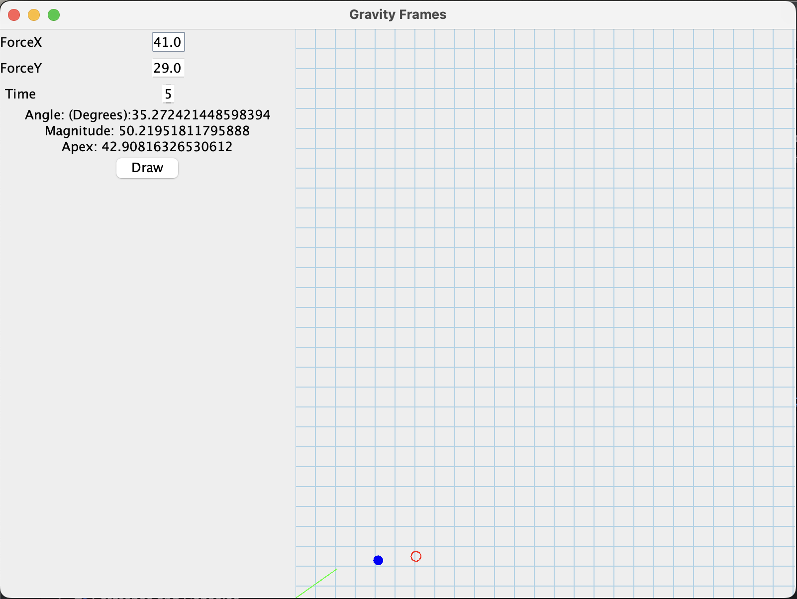

### Forces and Projectile Physics

This project is a Java Swing program that simulates projectile motion using forces.
The user can type in values for Force X, Force Y, and time, or use the mouse to adjust
the force. The projectile is drawn on a graph, and the program displays the angle, magnitude,
and apex.

### Screenshots

#### Links

- [Mockito](https://site.mockito.org/)
- [GridBagLayout](https://docs.oracle.com/javase/tutorial/uiswing/layout/gridbag.html)
- [JUnit 5](https://junit.org/junit5/)